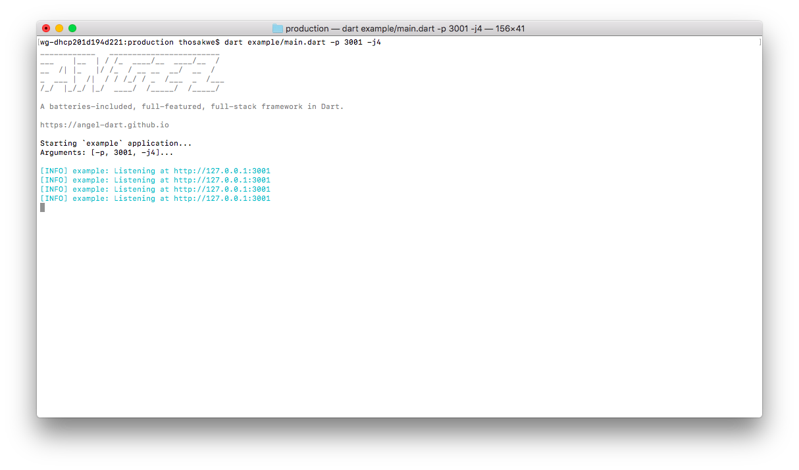

# production
Helpers for concurrency, message-passing, rotating loggers, and other production functionality in Angel.



This will become the de-facto way to run Angel applications in deployed environments, as it
takes care of inter-isolate communication, respawning dead processes, and other housekeeping for you automatically.

Most users will want to use the `Runner` class.

## `Runner`
`Runner` is a utility, powered by `package:args`, that is intended to be the entry point of your application.

Instantiate it as follows, and your file will become a command-line executable that spawns multiple instances of your
application:

```dart
import 'dart:async';
import 'dart:isolate';
import 'package:angel_framework/angel_framework.dart';
import 'package:angel_production/angel_production.dart';

main(List<String> args) => new Runner('example', configureServer).run(args);

Future configureServer(Angel app) async {
  app.get('/', (req, res) => 'Hello, production world!');

  app.get('/crash', (req, res) {
    // We'll crash this instance deliberately, but the Runner will auto-respawn for us.
    new Timer(const Duration(seconds: 3), Isolate.current.kill);
    return 'Crashing in 3s...';
  });
}
```

`Runner` will automatically re-spawn crashed instances, unless `--no-respawn` is passed. This can prevent
your server from entirely going down at the first error, and adds a layer of fault tolerance to your
infrastructure.

When combined with `systemd`, deploying Angel applications on Linux can be very simple.

## Message Passing
The `Runner` class uses [`package:pub_sub`](https://github.com/thosakwe/pub_sub) to coordinate
message passing between isolates.

When one isolate sends a message, all other isolates will
receive the same message, except for the isolate that sent it.

It is injected into your application's `Container` as
`pub_sub.Client`, so you can use it as follows:

```dart
```

## Command-line Options
The `Runner` class supplies options like the following:

```
wg-dhcp201d194d221:production thosakwe$ dart example/main.dart --help
____________   ________________________ 
___    |__  | / /_  ____/__  ____/__  / 
__  /| |_   |/ /_  / __ __  __/  __  /  
_  ___ |  /|  / / /_/ / _  /___  _  /___
/_/  |_/_/ |_/  ____/  /_____/  /_____/

A batteries-included, full-featured, full-stack framework in Dart.

https://angel-dart.github.io

Options:
-h, --help            Print this help information.
    --[no-]respawn    Automatically respawn crashed application instances.
                      (defaults to on)

    --use-zone        Create a new Zone for each request.
-a, --address         The address to listen on.
                      (defaults to "127.0.0.1")

-j, --concurrency     The number of isolates to spawn.
                      (defaults to "4")

-p, --port            The port to listen on.
                      (defaults to "3000")
```