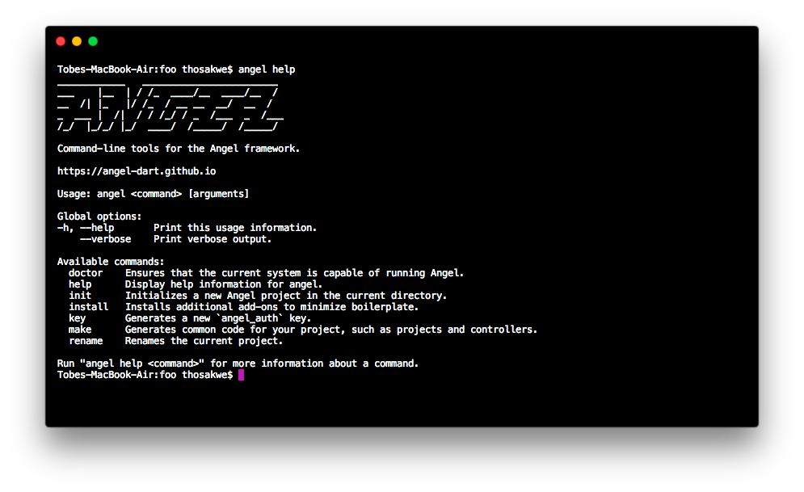

# angel_cli



Command-line tools for the Angel framework.
Includes functionality such as:
* Project scaffolding
* Generating service models, plugins, tests and more
* Renaming projects
* Much more...

To install:

```bash
$ pub global activate angel_cli
```

And then, for information on each command:

```bash
$ angel help
```
